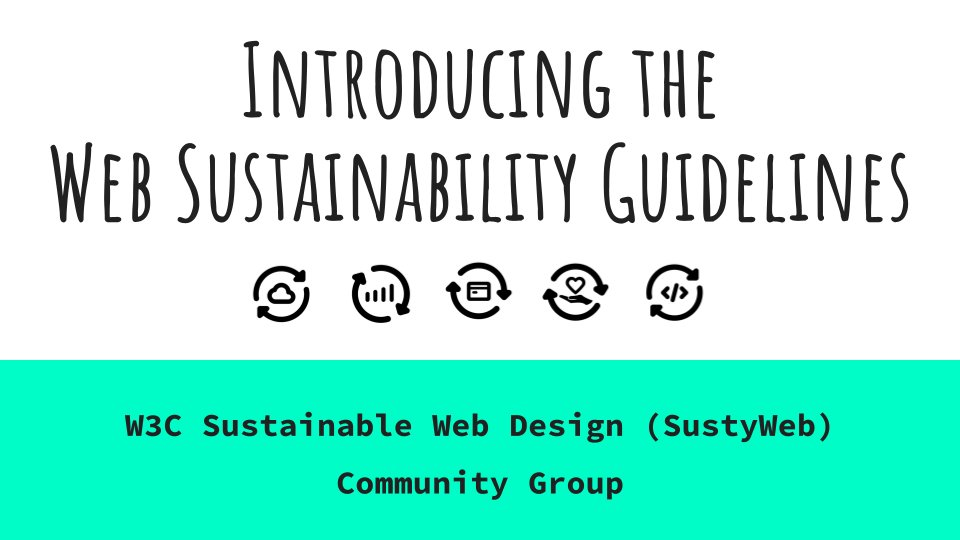

> 11\-15 Sept\.: This is the \#w3cTPAC week, dedicated to discussions in and between groups to gather new ideas, raise questions and better coordinate the \#WebStandards work\. The meeting is hybrid with the main in\-person hub in Seville 🇪🇸  
> https://www\.w3\.org/2023/09/TPAC/
> 🗓️September@w3c: the W3C community is going to       \#Seville 🇪🇸 for TPAC\!

 [Sep 01 2023, 13:48:20 UTC](https://twitter.com/w3cdevs/status/1697607324091724189)

----

> 12 Sept\.: @w3c member\-only \(Advisory Committee \- AC\) meeting that focuses on strategic issues facing the Consortium, and future directions envisioned by the membership and staff \#w3cTPAC

 [Sep 01 2023, 13:48:21 UTC](https://twitter.com/w3cdevs/status/1697607326918652229)

----

> 13 Sept\.: Already 57 proposed \#w3cTPAC breakout sessions\! These are series of 1\-hour sessions on community identified topics https://github\.com/w3c/tpac2023\-breakouts/issues

 [Sep 01 2023, 13:48:22 UTC](https://twitter.com/w3cdevs/status/1697607329603063866)

----

> 27 Sept\.: @BillKasdorf, W3C Global Publishing Evangelist, will join others in a panel "\#AI: Revolution and Opportunity in Trade Publishing" held as part of the @PublishersWkly online conference https://www\.publishersweekly\.com/pw/by\-topic/industry\-news/trade\-shows\-events/article/92954\-markus\-dohle\-ethan\-mollick\-to\-keynote\-ai\-webinar\.html

 [Sep 01 2023, 13:48:23 UTC](https://twitter.com/w3cdevs/status/1697607336280441145)

----

> 26\-28 Sept\.: virtual \#W3CWorkshop "Secure the Web Forward" that brings together experts in standards and best practices needed to secure \#WebApps \#security \#developers   
> https://www\.w3\.org/2023/03/secure\-the\-web\-forward/index\.html

 [Sep 01 2023, 13:48:23 UTC](https://twitter.com/w3cdevs/status/1697607333612773451)

----

> 28\-30 Sept\.: Paris Web 2023 \- online event @parisweb https://paris\-web\.fr

 [Sep 01 2023, 13:48:24 UTC](https://twitter.com/w3cdevs/status/1697607339807736130)

----

> For \#w3cTPAC, @tidoust demonstrates how web technologies such as \#WebCodecs, \#WebGPU, \#WebRTC, \#Streams, etc\. create a very powerful platform to process video frames in  real\-time\. Slides and transcript avail\. at  https://www\.w3\.org/2023/09/TPAC/demos/video\-processing\.html  
> https://youtu\.be/bEP5VrMtGaE
> For in\-depth insight, read the 2\-part article that explores how \#WebApps can build processing media pipelines, by @tidoust and @dontcallmeDOM \.\./2023/2023\-03\-tweets\.html\#x1640689570650914818

 [Sep 05 2023, 10:20:18 UTC](https://twitter.com/w3cdevs/status/1699004521341440322)

----

> CSS View Transitions Module Level 1 allows \#developers to create  rich transitions between two page states\. It defines a set of \#APIs that allow DOM changes to smoothly animate between states\.
> The @csswg invites implementations of the "\#CSS View Transitions Module Level 1" specification \#CandidateRecommendation \#timetoimplement   
> https://www\.w3\.org/TR/css\-view\-transitions\-1/ https://twitter\.com/w3c/status/1698997241627758898

 [Sep 05 2023, 12:15:02 UTC](https://twitter.com/w3cdevs/status/1699033396725325973)

----

> Authors eagerly await this feature in browsers, sparking numerous demos\. Watch \#CSS View Transitions in action with this \#w3cTPAC video by @bramus\!  
> https://youtu\.be/xZteiW\-cun8

 [Sep 05 2023, 12:15:03 UTC](https://twitter.com/w3cdevs/status/1699033399158100082)

----

> Please send comments and feedback to the related \#GitHub repo:  https://github\.com/w3c/csswg\-drafts/labels/css\-view\-transitions

 [Sep 05 2023, 12:15:04 UTC](https://twitter.com/w3cdevs/status/1699033404698714575)

----

> CSS View Transitions Level 1 focuses on transitions within a single page\. The Level 2 of the spec\., released as a first public working draft today, extends it to transitions between two web pages \#FPWD \#timetogiveinput  
> https://www\.w3\.org/TR/css\-view\-transitions\-2/  
> https://twitter\.com/w3c/status/1699000753531027891

 [Sep 05 2023, 12:15:04 UTC](https://twitter.com/w3cdevs/status/1699033401720742171)

----

> \#Translation https://twitter\.com/webi18n/status/1699006481654329855

 [Sep 05 2023, 12:49:59 UTC](https://twitter.com/w3cdevs/status/1699042188846342624)

----

> For \#w3cTPAC, @ddbeck, \#WebDX \#CommunityGroup member, presents the \`web\-features\` project that seeks to understand the expectations and desires of web \#developers, catering to their needs and interests \#WebPlatform  
> Transcript at https://www\.w3\.org/2023/09/TPAC/demos/web\-features\.html  
> https://youtu\.be/5jVwu3jwBmE

 [Sep 06 2023, 10:22:56 UTC](https://twitter.com/w3cdevs/status/1699367571357605966)

----

> For \#w3cTPAC, the @W3C\_WoT crafted an introductory video on the Web of  Things \(\#WoT\), as part of a tutorial series covering its applications and tools for newcomers\.  
> Video transcript is at https://www\.w3\.org/2023/09/TPAC/demos/what\-is\-wot\.html  
> 🎬 https://youtu\.be/a6gShw2EV4U

 [Sep 06 2023, 14:19:11 UTC](https://twitter.com/w3cdevs/status/1699427027462357300)

----

> For \#w3cTPAC, @patrick\_h\_lauke gives an overview of the Pointer Events \#WorkingGroup, and goes over changes and additions \(w/ short demos\!\) brought in the Pointer Events Level 3 specification\.   
> Slides and transcript avail\. at  https://www\.w3\.org/2023/09/TPAC/demos/pointer\-events\.html  
> https://youtu\.be/ourOCCThDZ4

 [Sep 07 2023, 10:08:36 UTC](https://twitter.com/w3cdevs/status/1699726350662181031)

----

> For \#w3cTPAC, @hochsays gives updates of the @w3caudio work and shares amazing apps and projects \#developers have created with web \#music technology\.   
> Slides and transcript at https://www\.w3\.org/2023/09/TPAC/demos/web\-audio\.html  
> https://youtu\.be/at4NazZOgsU

 [Sep 07 2023, 14:01:36 UTC](https://twitter.com/w3cdevs/status/1699784990865907912)

----

> 🆕 Web Sustainability Guidelines \(WSG\) 1\.0 promote eco\-friendly digital products and services that put people and planet first\. They are best practice aimed at end\-users, web workers, stakeholders, tool authors, educators, and policymakers \#Sustainability https://w3c\.github\.io/sustyweb/ https://twitter\.com/w3c/status/1699874525008040261
> 🌍 The digital industry emits 2\-5% of global emissions, more than aviation\! WSG offers tips like data transfer cutback, image optimization and green hosting use to reduce the environmental impact of web development and design \#FootPrint

 [Sep 08 2023, 13:19:52 UTC](https://twitter.com/w3cdevs/status/1700136872826040699)

----

> We welcome your participation in the Sustainable Web Design \(SystyWeb\) \#CommunityGroup \- https://www\.w3\.org/community/sustyweb/ \- as well as feedback via the \#GitHub repo: https://github\.com/w3c/sustyweb/

 [Sep 08 2023, 13:19:54 UTC](https://twitter.com/w3cdevs/status/1700136884658168272)

----

> 📚 With 93 guidelines and 232 success criteria inspired by \#WCAG, WSG  covers User Experience, Web Development, Hosting, and Business Strategy\.  Rea "WSG at a glance": https://w3c\.github\.io/sustyweb/glance\.html for a quick review of the guidelines 
> 
> 

 [Sep 08 2023, 13:19:54 UTC](https://twitter.com/w3cdevs/status/1700136880744865996)

----

> For \#w3cTPAC, @lbassbouss demoes "\#Metaverse Cloud Rendering on the Web" as a use case currently  under discussion within the @w3c Web &amp; Networks \#InterestGroup   
> \#EdgeRendering \#WebRTC \#WebCodecs \#WebTransport  
> https://www\.w3\.org/2023/09/TPAC/demos/web\-networks\.html  
> https://youtu\.be/AR4l7xIPdZA

 [Sep 12 2023, 10:00:16 UTC](https://twitter.com/w3cdevs/status/1701536195468001374)

----

> Submit your proposals for Interop 2024 by @rachelandrew, @robertnyman, @foolip, and @\_nairnm https://web\.dev/interop\-2024\-proposals/

 [Sep 15 2023, 15:03:23 UTC](https://twitter.com/w3cdevs/status/1702699639898571246)

----

> For \#w3cTPAC, M\. McCool and S\. Divakaran present distributed workers as a proposal to extend the web client program model to support distributed computing\. \#Wasm \#WebWorkers \#EdgeComputing Web&amp;Networks \#InterestGroup  
> Transcript at https://www\.w3\.org/2023/09/TPAC/demos/distrib\-workers\.html  
> https://youtu\.be/wb58LeRkv7s

 [Sep 19 2023, 12:17:04 UTC](https://twitter.com/w3cdevs/status/1704107337517011355)

----

> 📢Next week\! This \#W3CWorkshop is composed of 3 live sessions:  
> \- 26 Sept\.: Supply Chain \#Security  
> \- 27 Sept\.: \#JavaScript Security  
> \- 28 Sept\.: \#Developer Awareness  
> Attendance is 🆓 for all invited participants\. Find out how to register: https://www\.w3\.org/blog/2023/w3c\-virtual\-workshop\-on\-secure\-the\-web\-forward\-26\-28\-september\-2023/ https://twitter\.com/w3c/status/1704888606609797503

 [Sep 21 2023, 16:46:55 UTC](https://twitter.com/w3cdevs/status/1704900021747937728)

----

> Dive into @w3cTAG's Privacy Principles\! @jyasskin presents ethical web principles for \#privacy\. The doc\. aims to set constraints, provide checklists, and explain web norms \#PrivacyMatters \#EthicalWeb  
> https://www\.w3\.org/2023/09/TPAC/ac\-privacy\-principles \(incl\. transcript\)   
> https://youtu\.be/\_PRZV6lMupE
> The document has two main sections: background knowledge and principles\. It emphasizes collective governance, user agent duties, minimizing data, protecting sensitive information, de\-identifying data, group privacy, and safeguarding against abuse\.   
>  https://www\.w3\.org/TR/privacy\-principles/

 [Sep 25 2023, 15:53:15 UTC](https://twitter.com/w3cdevs/status/1706336067559764409)

----

> It focuses on respectful consent requests, non\-intrusive notifications, and user data choice\. Vulnerable users and children are considered\. Learn how to protect your online privacy\! \#OnlineSafety \#DataProtection

 [Sep 25 2023, 15:53:16 UTC](https://twitter.com/w3cdevs/status/1706336073377329397)

----

> The Privacy Principles task force is finalizing the document, promoting user autonomy, and respecting consent\. Get involved an send suggestions via \#GitHub at https://github\.com/w3ctag/privacy\-principles

 [Sep 25 2023, 15:53:17 UTC](https://twitter.com/w3cdevs/status/1706336075910619136)

----

> Dr\. Humera Noor Minhas \(@eyeo\) explains that building \#EthicalAI isn't  just about guidelines; it's about practice\. Let's embed ethics into the  heart of \#AI development right from the start \#ethics \#w3cTPAC  
> https://www\.w3\.org/2023/09/TPAC/ac\-lt\-ethical\-ai \(incl\. transcript\)  
> https://youtu\.be/UJ8j0XNduJM
> W3C's Ethical Principles for Web Machine Learning exist, but how do we make them a  reality? Train and involve your teams, and make ethics part of your processes\!   
> https://www\.w3\.org/TR/webmachinelearning\-ethics/

 [Sep 26 2023, 13:53:49 UTC](https://twitter.com/w3cdevs/status/1706668399622058086)

----

> 🤖This \#EthicalAI topic was also discussed during a \#w3cTPAC breakout session\. Find the minuted discussion and other info at https://www\.w3\.org/2023/09/TPAC/breakouts\.html\#b\-9f1667d4\-a23b\-4893\-80aa\-06d5ecca8434

 [Sep 26 2023, 13:53:51 UTC](https://twitter.com/w3cdevs/status/1706668406286721109)

----

> 🔜 Today's live session is about "Supply Chain Security" \(from 3pm to 5pm UTC\)  
> Check the session's agenda and papers at: https://www\.w3\.org/2023/03/secure\-the\-web\-forward/agenda\.html\#session\-1  
> \#security \#developers cc @tidoust @torgo https://twitter\.com/openssf/status/1706678265698525571

 [Sep 26 2023, 14:49:53 UTC](https://twitter.com/w3cdevs/status/1706682507339370758)

----

> 🌱 The \#ClimateCrisis is a major issue, and the digital sector plays a significant role\. It contributes 2\-5% of global greenhouse gas emissions throughout its lifecycle, starting from manufacturing of digital equipment through the use of networks, data centers, and your devices
> Let's make the web more \#sustainable\! At \#w3cTPAC, Łukasz Mastalerz \(@ClimateArc\) introduces \#SustainableWeb guidelines for web creators to make sure their content has as small negative impact on the environment as possible  
> https://www\.w3\.org/2023/09/TPAC/ac\-lt\-sustyweb  
> https://youtu\.be/86xcPqL\-0Hc

 [Sep 27 2023, 11:48:53 UTC](https://twitter.com/w3cdevs/status/1706999348888797443)

----

> 📚 Inspired by @w3c\_wai's work on web \#accessibility, the SustyWeb \#CommunityGroup worked with experts from nearly 50 organizations, resulting in a draft of 93 guidelines with 200\+ success criteria \#SustainableWeb  
> Read more: \.\./2023/2023\-09\-tweets\.html\#x1700136872826040699

 [Sep 27 2023, 11:48:54 UTC](https://twitter.com/w3cdevs/status/1706999352135196905)

----

> The Web Sustainability guidelines was also a \#w3cTPAC breakout session topic\. Find the minuted discussion and other info at: https://www\.w3\.org/2023/09/TPAC/breakouts\.html\#b\-e29ce12c\-b91a\-4714\-95ec\-a0a6775daafb

 [Sep 27 2023, 11:48:55 UTC](https://twitter.com/w3cdevs/status/1706999355108937924)

----

> 🔜 Today's live session is about "\#JavaScript Security"  
> \(from 3pm to 5pm UTC\)   
> Check the session's agenda and papers at: https://www\.w3\.org/2023/03/secure\-the\-web\-forward/agenda\.html\#session\-2  
> \#security \#developers cc @tidoust @torgo https://twitter\.com/openssf/status/1706678265698525571

 [Sep 27 2023, 13:37:46 UTC](https://twitter.com/w3cdevs/status/1707026750192890289)

----

> Do you trust how your personal data is managed online today? @0x8DEB \(@digi\_vlaanderen\) explores data handling and how decentralized data storage servers can give control back to users \#Solid \#privacy \#w3cTPAC https://www\.w3\.org/2023/09/TPAC/ac\-lt\-user\-data\-control \(w/ slides\+transcript\)  
> https://youtu\.be/0EmMx6X5wyU
> The challenge is that while we gather more data for business, users often face obscure policies and have limited control\. Regulations like  \#GDPR attempt to address this, but they lag behind real\-world practices

 [Sep 28 2023, 08:56:49 UTC](https://twitter.com/w3cdevs/status/1707318432822186121)

----

> Based on the Solid ecosystem, the @w3c Solid \#CommunityGroup worked on a proposed charter for a Solid \#WorkingGroup: https://solid\.github\.io/solid\-wg\-charter/charter/ \(currently under review\)

 [Sep 28 2023, 08:56:50 UTC](https://twitter.com/w3cdevs/status/1707318437968486510)

----

> 🔜 Today's live session \(and last one\) is about "\#Developer Awareness" \(from 3pm to 5pm UTC\)  Check the session's agenda and papers at: https://w3\.org/2023/03/secure\-the\-web\-forward/agenda\.html\#session\-3 \#security  cc @tidoust @torgo https://twitter\.com/openssf/status/1706678265698525571

 [Sep 28 2023, 14:32:45 UTC](https://twitter.com/w3cdevs/status/1707402971976253793)