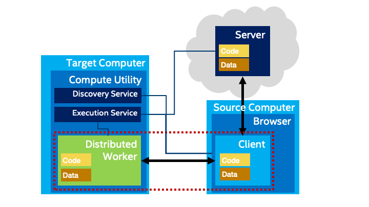
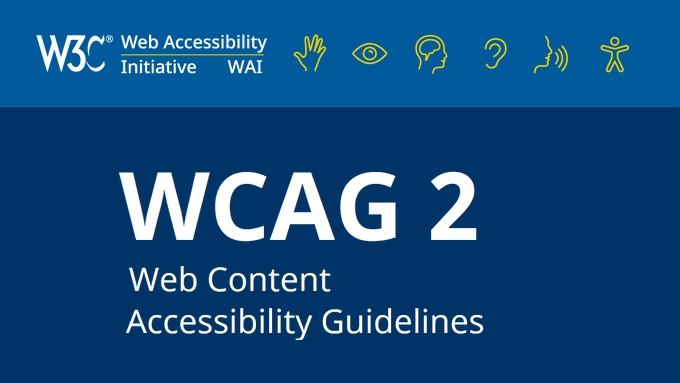
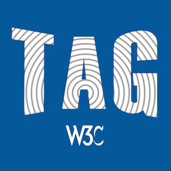

> Comments are welcome via \#GitHub by 21 December 2023: https://github\.com/w3c/PNG\-spec/issues
> The @w3c Portable Network Graphics \(PNG\) \(3rd Edition\) is in \#CandidateRecomendation status\. PNG is an extensible file format for the lossless, portable, well compressed storage of static and animated raster images \#timetoimplement  
> https://www\.w3\.org/TR/png\-3/ https://twitter\.com/w3c/status/1704786723895398442

 [Oct 02 2023, 08:54:21 UTC](https://twitter.com/w3cdevs/status/1708767364341170185)

----

> The @w3c Web&amp;Networks Interest Group published "Client\-Edge\-Cloud  coordination Use Cases and Requirements" as a first draft note \#EdgeComputing \#WebNN \#CloudIT \#WebWorkers   
> https://www\.w3\.org/TR/2023/DNOTE\-edge\-cloud\-reqs\-20230926/
> This document explores how the traditional client/server architecture used by \#WebApps could be improved by including  \#EdgeComputing resources\. An architectural proposal suggests expanding the capabilities of Workers\. 
> 
> 

 [Oct 02 2023, 14:25:17 UTC](https://twitter.com/w3cdevs/status/1708850646114312440)

----

> Watch this \#w3cTPAC demo 🎬 where Michael McCool presents \#DistributedWorkers as a proposal to extend  the web client program model to support distributed computing \#WASM \#WebPerformance  
> https://youtu\.be/wb58LeRkv7s

 [Oct 02 2023, 14:25:19 UTC](https://twitter.com/w3cdevs/status/1708850653622051074)

----

> Feedback is welcome in the related \#GitHub: https://github\.com/w3c/edge\-computing\-web\-exploration/

 [Oct 02 2023, 14:25:20 UTC](https://twitter.com/w3cdevs/status/1708850656683917477)

----

> October@w3c: \#WoT, \#automotive, \#a11y\. More in https://www\.w3\.org/events/
> 5 Oct\.: The @W3C\_WoT \#CommunityGroup organizes a meetup online  \#WoT https://www\.linkedin\.com/events/wotcgmeetup10\-seamandwot7114488421712044032/about/

 [Oct 03 2023, 07:38:18 UTC](https://twitter.com/w3cdevs/status/1709110613090119993)

----

> 10\-12 Oct\.: Kevin White and @shawna\_slh of the @w3c\_wai team speak @mEnablingSummit, \#WashingtonDC 🇺🇸   
> https://m\-enabling\.com/

 [Oct 03 2023, 07:38:19 UTC](https://twitter.com/w3cdevs/status/1709110618584715543)

----

> 11 Oct\.: W3C Project &amp; Strategy Lead @plhw3org gives a talk on "Moving the Web and Automotive Forward" @COVESAglobal's "All Member  Meeting", \#Michigan 🇺🇸  
> https://www\.eventleaf\.com/e/COVESAAMM23US

 [Oct 03 2023, 07:38:20 UTC](https://twitter.com/w3cdevs/status/1709110621336125517)

----

> Accessibility is an integral part of W3C Inc\.'s mission and vision, and during \#w3cTPAC, @shawna\_slh gave an activity update for @w3c\_wai in  2023 \#a11y   
> https://www\.w3\.org/2023/09/TPAC/ac\-activities\-wai\.html \(w/ slides and  transcript\)  
> Also on \#YT: https://youtu\.be/rJy7HeRio6A
> There is a lot happening, incl\. \#WCAG22 nearing recommendation and progress on translations \(35 languages today\!\)\. Stay updated on publications and monthly updates at https://www\.w3\.org/WAI/update/

 [Oct 04 2023, 13:26:50 UTC](https://twitter.com/w3cdevs/status/1709560714006786118)

----

> In 2024 and beyond, the @w3c\_wai team is setting strategic priorities, defining their mission and vision to better support \#accessibility\. With 16\+ WGs and TFs, they are looking for skilled technical writers, editors, etc\. Together, we can create a more accessible web\!

 [Oct 04 2023, 13:26:52 UTC](https://twitter.com/w3cdevs/status/1709560721074159941)

----

> At \#w3cTPAC, @pchampin explained that several W3C groups are actively working on data\-related Web standards: \#RDFStar, \#VerifiableCredentials, Dataset Exchange, \#JSONLD, \#WoT   
> Find out more at https://www\.w3\.org/2023/09/TPAC/ac\-activities\-data \(w/ slides an transcript\)  
> Also on \#YT: https://youtu\.be/TBIkRB6c\-d8

 [Oct 04 2023, 15:12:42 UTC](https://twitter.com/w3cdevs/status/1709587353243644189)

----

> 👏👏👏 Congrats to editors @alastc, Chuck Adams, @RLBMontgomery, Michael Cooper and @awkawk for the newly published @w3c \#WebStandard "Web Content Accessibility Guidelines \(WCAG\) 2\.2" \#accessibility \#a11y \#WCAG22 \#timetoadopt https://twitter\.com/w3c/status/1709914043643785230 
> 
> 

 [Oct 05 2023, 14:02:53 UTC](https://twitter.com/w3cdevs/status/1709932170083787022)

----

> 🎬The recordings of last week's talks at the @w3c workshop \#SecureWebForward are now published\! \#security \#developers  
> Find them all w/ slides and transcripts in https://www\.w3\.org/2023/03/secure\-the\-web\-forward/agenda\.html   
> Also avail\. via  a \#YT playlist: https://www\.youtube\.com/watch?v\=U68zPZSc7nk&list\=PLNhYw8KaLq2V\-EvC1Mcdms3xvkrXjNEpX

 [Oct 05 2023, 14:24:50 UTC](https://twitter.com/w3cdevs/status/1709937694070219028)

----

> 48 new spec\. proposals were reviewed in 2023, making sure they align with the principles of the web\. The @w3ctag also facilitate task forces, e\.g\. the joint task force with  the Privacy \#InterestGroup on \#Privacy Principles\.  
> Learn more  https://www\.w3\.org/2001/tag/ 
> 
> 
> The @w3ctag \(Technical Architecture Group\) is the guiding light for web architecture principles and problem\-solving\. At \#w3cTPAC, @torgo gave an update on the group's activities\. Find out more: https://www\.w3\.org/2023/09/TPAC/ac\-tag \(w/ slides \+ transcript\)   
> Also on \#YT: https://youtu\.be/xmnyD6\-TnjY

 [Oct 05 2023, 18:29:27 UTC](https://twitter.com/w3cdevs/status/1709999257158111525)

----

> W3C's privacy efforts are continuing to expand, with plans for two 2 Working Groups, Private Advertising Technology \#PAT, \#Privacy\. Get details and learn more from Sam Weiler, W3C Privacy Lead, w/ slides and transcript: https://www\.w3\.org/2023/09/TPAC/ac\-activities\-privacy  
> Also on \#YT: https://youtu\.be/pBIq\-pIU2Is

 [Oct 06 2023, 08:19:19 UTC](https://twitter.com/w3cdevs/status/1710208097841459635)

----

> Coding contest for🇫🇷students: to develop a \#WebApp for mobile devices \#MiniApps, \#WebXR, \#WebRTC, \#PWAs, etc\.   
> Win 🏆 for the 3 best projects\!   
> Please register before 12 Oct\.: https://systematic\-paris\-region\.org/evenement/web\-technologies\-for\-applications\-coding\-contest/ https://twitter\.com/Pole\_Systematic/status/1709584502647865639

 [Oct 06 2023, 08:43:31 UTC](https://twitter.com/w3cdevs/status/1710214188885270920)

----

> \#SecureWebForward Your web app as a  bottle of shampoo\! Jan Kowalleck describes Software Bill of Materials \(\#SBOMs\) applied to \#WebApps \#security   
> Paper and slides: https://www\.w3\.org/2023/03/secure\-the\-web\-forward/agenda\.html\#session\-1  
> 🎬 https://youtu\.be/RhHT3R0lIPg

 [Oct 06 2023, 09:02:48 UTC](https://twitter.com/w3cdevs/status/1710219039824367959)

----

> \#SecureWebForward Gary O'Neall describes possible improvements to \#SBOMs to ease discovery, handle complexity and improve interoperability\.   
> \#security \#standardization  
> Papers and slides: https://www\.w3\.org/2023/03/secure\-the\-web\-forward/agenda\.html\#session\-1  
> Also on \#YT: 🎬 https://youtu\.be/M4s8JY4DQTI

 [Oct 06 2023, 10:54:55 UTC](https://twitter.com/w3cdevs/status/1710247257621090548)

----

> In this talk, @dontcallmeDOM reviews the intersections of @w3c work and the impact of  recent developments in \#AI: https://www\.w3\.org/2023/09/TPAC/ac\-activities\-ai \(🎬 w/ slides \+ transcript\)  
> Also on \#YT: https://youtu\.be/E0TbotgqAgw?si\=AM7rJguK5HaUe3Kv
> W3C has active ongoing work on making \#browsers a better platform to run  \#MachineLearning models through its Web Neural Network API \#WebNN,  incl\. recent work in adding support for Transformers, a key component to \#GenerativeAI models   
> https://github\.com/webmachinelearning/webnn/issues/375

 [Oct 06 2023, 12:00:03 UTC](https://twitter.com/w3cdevs/status/1710263647333679485)

----

> The @w3c community still needs a lot of discussions to figure out the right answers to these questions\.   
> Two \#w3cTPAC breakouts of interest:  1⃣ "Impact of \#GenerativeAI on the Web" https://www\.w3\.org/2023/09/13\-GenerativeAI\-minutes\.html  2⃣ "\#EthicalAI in a Rapidly Evolving Landscape" http://www\.w3\.org/2023/09/tpac\-breakouts/72\-minutes\.pdf

 [Oct 06 2023, 12:00:05 UTC](https://twitter.com/w3cdevs/status/1710263657223925998)

----

> But the intersection between Web and AI spans a much broader set of questions: ethical impact of relying on \#AI and \#MachineLearning models ; impact on content creation, on user interactions, on content re\-use, and the risk of creating new centralization bottlenecks

 [Oct 06 2023, 12:00:05 UTC](https://twitter.com/w3cdevs/status/1710263654522785879)

----

> \#SecureWebForward What if \#security researchers could audit the source code of \#WebApps sent to any user, and not just to themselves? @twisstle presents the "Source Code Transparency" proposal in https://www\.w3\.org/2023/03/secure\-the\-web\-forward/agenda\.html\#session\-1 \(slides \+ 🎬transcript\)  
> Also on \#YT: https://youtu\.be/qhc\_3W3JZAw

 [Oct 06 2023, 13:28:26 UTC](https://twitter.com/w3cdevs/status/1710285891665629495)

----

> \#SecureWebForward Hardened \#JavaScript creates a more secure runtime environment for \#WebApp code\. @naugtur reviews the Compartment proposal that could let code escape, such as access to DOM and the creation of realms\.  
> ▶️ https://www\.w3\.org/2023/03/secure\-the\-web\-forward/agenda\.html\#session\-2  
> 🎬 https://youtu\.be/U68zPZSc7nk

 [Oct 06 2023, 16:31:14 UTC](https://twitter.com/w3cdevs/status/1710331893521006905)

----

> \#SecureWebForward   
> Building on @naugtur's insights, @WeizmanGal presents ways to trap the many ways to create \#JavaScript realms in a \#WebApp\. It comes with a performance cost\. Could native hooks be created instead?   
> https://www\.w3\.org/2023/03/secure\-the\-web\-forward/agenda\.html\#session\-2   
> 🎬 https://youtu\.be/zxO9vW4qwns

 [Oct 06 2023, 18:36:17 UTC](https://twitter.com/w3cdevs/status/1710363364411449767)

----

> \#SecureWebForward   
> @arturjanc presents a \#security perspective on \#cookies with a model aligned with the current direction to deprecate third\-party cookies taken by \#browser vendors https://www\.w3\.org/2023/03/secure\-the\-web\-forward/agenda\.html\#session\-2 \(slides\+transcript\)  
> https://youtu\.be/H2k0aPIWTTo

 [Oct 09 2023, 14:15:00 UTC](https://twitter.com/w3cdevs/status/1711384772658794668)

----

> \#SecureWebForward \~1B websites run jQuery\! And \~500M of these run an "outdated and unpatched version" of \#jQuery\. @tobie is focusing on \#security holes that jQuery opens in the web browser sandbox that don't exist without it: https://www\.w3\.org/2023/03/secure\-the\-web\-forward/agenda\.html\#session\-3  
> https://youtu\.be/efOljAYQz2I

 [Oct 09 2023, 15:27:00 UTC](https://twitter.com/w3cdevs/status/1711402891087405431)

----

> \#SecureWebForward CSP,  CORS, SRI, strict mode\.\.\. Web app \#security is complicated\. @floscholz explores a program that @OpenWebDocs could perhaps implement to enhance @MozDevNet documentation on  security\. https://www\.w3\.org/2023/03/secure\-the\-web\-forward/agenda\.html\#session\-3 \(w/ slides\+transcript\)  
> https://youtu\.be/aAx6\-wPaOHc

 [Oct 10 2023, 12:30:00 UTC](https://twitter.com/w3cdevs/status/1711720735511871741)

----

> \#SecureWebForward Ben Sternthal and Joe Sepi review @openjsf projects to customize OpenSSF and OWASP best practices, and create a \#JavaScript  \#security training\. https://www\.w3\.org/2023/03/secure\-the\-web\-forward/agenda\.html\#session\-3 \(w/ slides and transcript\)  
> Also on \#YT: https://youtu\.be/5mP5qTmdzcI

 [Oct 10 2023, 14:37:00 UTC](https://twitter.com/w3cdevs/status/1711752695928016904)

----

> At \#w3cTPAC, Shi Ling highlighted the use of \#WebAssembly to improve \#WebPerf and introduced JWST \(JavaScript\-to\-WASM Static Translator\)   
> https://www\.w3\.org/2023/09/TPAC/ac\-lt\-wasm\-perf \(🎬 w/ slides and transcript\)   
> Also on \#YT: https://youtu\.be/vEVv\-8kHyyM
> \#developers can use \#JavaScript or \#TypeScript to develop apps, and then JWST transforms that code into high\-performance WebAssembly, up to 30% to 50% faster than running it with node\.js \#nodejs \#WASM

 [Oct 18 2023, 11:03:55 UTC](https://twitter.com/w3cdevs/status/1714598177829990714)

----

> Addressing challenges such as \#AI's deployment and misinformation while preserving the openness of the Web require documenting the foundational principles of @w3c\. A \#w3cTPAC talk by @TzviyaSiegman    
> https://www\.w3\.org/2023/09/TPAC/ac\-vision \(🎬 w/ slides and transcript\)   
> https://youtu\.be/uDEsXozzxik
> This text clarifies the role and importance of W3C and its principles, rooted in \#interoperability, \#accessibility,  \#internationalization and \#privacy  
> https://www\.w3\.org/TR/w3c\-vision/

 [Oct 18 2023, 14:33:32 UTC](https://twitter.com/w3cdevs/status/1714650927372874237)

----

> At \#w3cTPAC, @plhw3org an Ding Wei discussed priorities and processes related to incubating new ideas and technologies within @w3c\.  
> https://www\.w3\.org/2023/09/TPAC/ac\-future\-work \(🎬 w/ slides and transcript\)  
> Also on \#YT: https://youtu\.be/3naC3iGkbAs

 [Oct 19 2023, 11:24:26 UTC](https://twitter.com/w3cdevs/status/1714965725700395476)